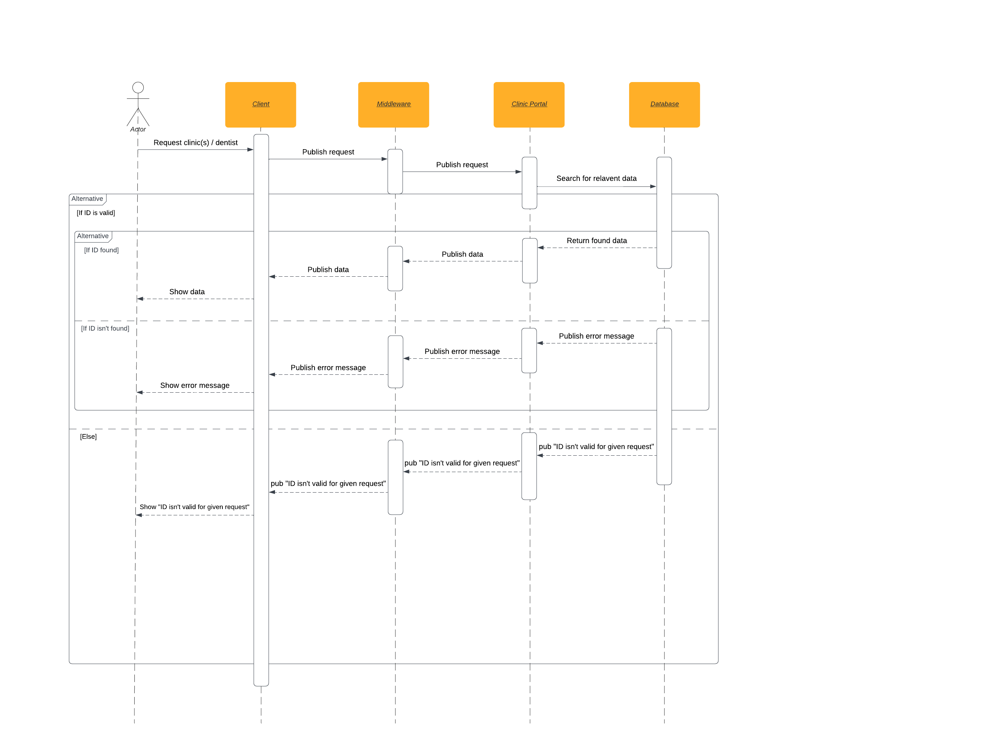

# Clinic Portal Component for the Dentismo Web Application

## Description
This component is necessary to retrieve the clinic, list of clinics, and information about the dentist from the database. Authentication component receives user credentials via the MQTT Protocol and verifies them using the database. Clinic portal component returns the dentist information that has been stored in the database upon successful authentication. When a user clicks on a specific clinic, information about that clinic is displayed that was returned from the database with the aid of the clinic portal. Clinic portal also returns a list of clinics from the database that is viewable from the UI.

## Badges - TODO
On some READMEs, you may see small images that convey metadata, such as whether or not all the tests are passing for the project. You can use Shields to add some to your README. Many services also have instructions for adding a badge.

## Visuals
### Sequence Diagram
This sequence diagram illustrates a use case where a user tries to find information on a dentist account, a clinic, and a list of clinics.


## Installation
1. Clone Repository
2. Via the terminal navigate to the cloned repository
3. Run `npm i` to download all required packages for running the app
4. Run `npm start` to run the component
5. Open the Client Dentismo website, you will see a list of clinics. If you click on one of them, you will see information for that clinic. If you log in using the proper credentials, you will have all the information you need in your account.

## Usage
Receiving a request from the user, confirming it via the system's backend to ensure that the ID is present in the database, and sending the user the information are the main tasks of this component. A individual dentist, a clinic, or a list of clinics are all examples of information. Here's an illustration of what can be delivered to the component:
```
{
    clinic_id: 637e0dbf0e5ac0363e1317ca
}
```
In this case, when you move on to the individual clinic page, it sends back the pertinent data required to retrieve the appropriate clinic. Although these details are saved to the database, they are displayed to the user in the frontend.

```
{
   "coordinate":{
      "longitude":11.942625,
      "latitude":57.685255
   },
   "openinghours":{
      "monday":{
         "start":8,
         "finish":16
      },
      "tuesday":{
         "start":10,
         "finish":15
      },
      "wednesday":{
         "start":12,
         "finish":18
      },
      "thursday":{
         "start":7,
         "finish":14
      },
      "friday":{
         "start":11,
         "finish":16
      }
   },
   "_id":"637e0dbf0e5ac0363e1317ca",
   "name":"Tooth Fairy Dentist",
   "dentists":1,
   "owner":"Tooth Fairy",
   "address":"Slottskogen",
   "city":"Gothenburg"
}
```

Or in the case that the information do not exist in the database

```
{
    message: "Clinic could not be found with given ID"
}
```

The user wants to retrieve (his/her) information in this situation.

```
{
    dentist_id: 637e0dbf0e5ac0363e1317ca
}
```

In this case, it gives back the pertinent information when you proceed to the dentist page after logging in. The user sees these details in the frontend.

```
{
   "_id":"6379385a4aad2aefb4d4a692",
   "name":"Hannibal Lecter",
   "username":"Dr.Lecter",
   "password":"loveMeat",
   "email":"lecter1@gmail.com",
}
```

Or in the case that the information do not exist in the database

```
{
    message: "Dentist could not be found with given ID"
}
```

Here, we want to obtain a list of clinics along with their information. There is no requirement in this case

```
[
   {
      "coordinate":{
         "longitude":11.942625,
         "latitude":57.685255
      },
      "openinghours":{
         "monday":{
            "start":8,
            "finish":16
         },
         "tuesday":{
            "start":10,
            "finish":15
         },
         "wednesday":{
            "start":12,
            "finish":18
         },
         "thursday":{
            "start":7,
            "finish":14
         },
         "friday":{
            "start":11,
            "finish":16
         }
      },
      "_id":"637e0dbf0e5ac0363e1317ca",
      "name":"Tooth Fairy Dentist",
      "dentists":1,
      "owner":"Tooth Fairy",
      "address":"Slottskogen",
      "city":"Gothenburg",
      "__v":0
   },
   {
      "coordinate":{
         "longitude":11.969388,
         "latitude":57.707619
      },
      "openinghours":{
         "monday":{
            "start":9,
            "finish":17
         },
         "tuesday":{
            "start":8,
            "finish":17
         },
         "wednesday":{
            "start":7,
            "finish":16
         },
         "thursday":{
            "start":9,
            "finish":17
         },
         "friday":{
            "start":9,
            "finish":15
         }
      },
      "_id":"637e0e730e5ac0363e1317cc",
      "name":"Dan Tist",
      "dentists":3,
      "owner":"Your dentist",
      "address":"Spannmålsgatan 20",
      "city":"Gothenburg",
      "__v":0
   },
   {
      "coordinate":{
         "longitude":11.969388,
         "latitude":57.707619
      },
      "_id":"63800c226be1f9736a000e95",
      "name":"Johnny",
      "dentists":3,
      "owner":"John Webb",
      "address":"avenue 20",
      "city":"Gothenburg",
      "__v":0
   }
]
```

Or in the case that the information do not exist in the database

```
{
    message:  "Clinics could not be found"
}
```
## Support
Developer of the component: [@bardiaf](https://git.chalmers.se/bardiaf) <br>
email: bardia.forooraghi@gmail.com

## Roadmap
No established roadmap is in place at this time.

## Contributing
I welcome contributions, but they must be sought via a merge request and followed up with an email outlining why.

- What is fixed by this?
- Why it's advantageous to the component?
- If the person is prepared to support these fixes and improvements going forward

## Authors and acknowledgment
The contributors to the Availability Checker Component include: <br>

**Bardia Forooraghi** - [@bardiaf](https://git.chalmers.se/bardiaf) <br>
- Lead Developer for the Component

**Georg Zsolnai** - [@zsolnai](https://git.chalmers.se/zsolnai) <br>
- Added CI/CD

## License - TODO
For open source projects, say how it is licensed.

## Project status
Clinic Portal has been finished. As a result, this repository won't be receiving any new changes for the time being. The additional elements of the larger Dentismo distributed system have been finished. We will develop tests to ensure everything is operating as expected as well as linking the backend to the frontend over the course of the upcoming few weeks. By December 16th, 2022, we hope to have completed the larger Dentismo project.
